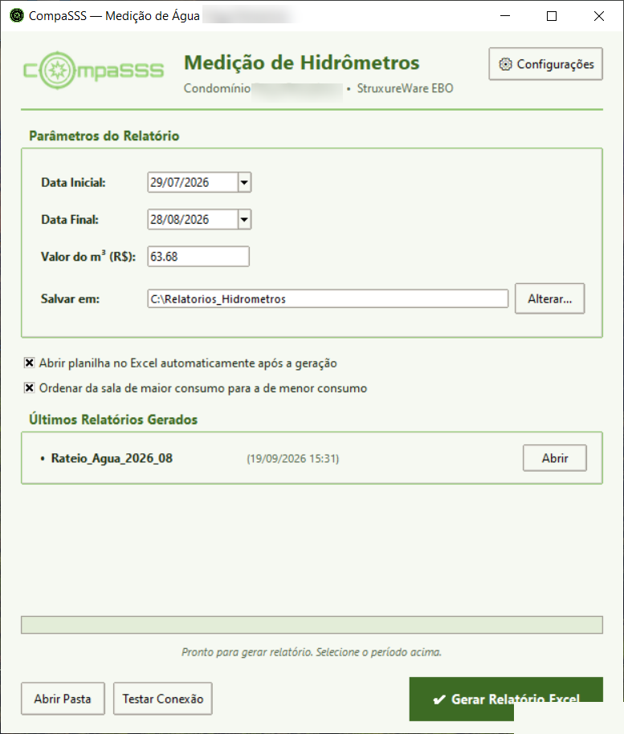
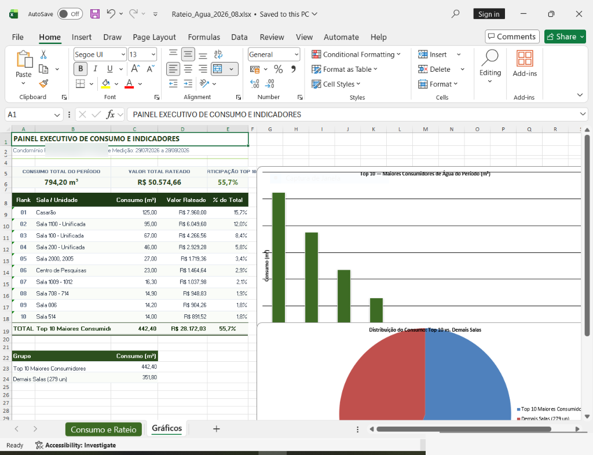
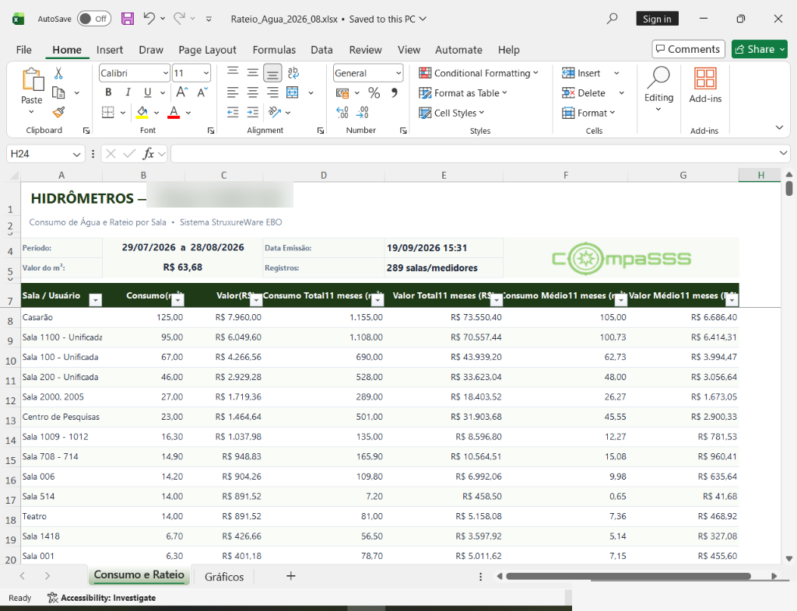

# 💧 SmartHydro — Automação de Telemetria e Gestão de Hidrômetros


-brightgreen?style=for-the-badge)
[](https://github.com/breno-camargo/Smarthydro/actions/workflows/ci.yml)

Sistema corporativo desenvolvido para extração, cálculo, auditoria e geração automatizada de relatórios mensais de consumo predial de água, conectado diretamente ao banco de dados do **Schneider Electric EcoStruxure Building Operation (EBO)**.

Operação em produção no **Condomínio Praça Pamplona** em parceria com a **CompaSSS Tecnologia e Automação**.

---

## 📌 Contexto & Problema Resolvido

Anteriormente, o rateio e a emissão mensal dos relatórios de hidrômetros dependiam de uma integração com um sistema legado de controle de acesso (W-Access). Após a migração tecnológica para a plataforma Keyaccess, o servidor antigo precisava ser mantido ativo sem licença e sem suporte oficial exclusivamente para emitir essa planilha.

O **SmartHydro** foi desenvolvido para:
1. **Eliminar o ponto único de falha (*Single Point of Failure*)**, conectando-se diretamente à fonte dos dados do BMS (*Building Management System*).
2. **Automatizar 100% da rotina operacional**, processando o ciclo de faturamento predial (dia 29 do mês anterior ao dia 28 do mês corrente).
3. **Garantir a integridade dos dados** através de algoritmos de detecção preventiva de anomalias (vazamentos, consumos atípicos e medições travadas).
4. **Agilizar a prestação de contas**, gerando planilhas executivas formatadas com gráficos e disparando e-mails com auditoria de entrega.

---

## ✨ Principais Funcionalidades

### 📡 Extração de Dados & Integração BMS
- Conexão nativa com **Microsoft SQL Server** via driver ODBC otimizado (`pyodbc`).
- Suporte a autenticação integrada do Windows (*Trusted Connection*) ou credenciais dedicadas de banco.
- Consultas parametrizadas que respeitam os carimbos de data/hora dos ciclos de medição predial.

### 📊 Relatórios Executivos em Excel (`openpyxl`)
- Formatação visual corporativa alinhada à identidade visual da CompaSSS e do Condomínio Praça Pamplona.
- **Painel de Indicadores (KPIs):** Total m³ consumido, valor total faturado, hidrômetro de maior consumo e média por unidade.
- **Gráficos Dinâmicos:** Comparativo de consumo por conjunto e análise visual do rateio.
- **Detalhamento Unidade a Unidade:** Leitura inicial, leitura final, consumo líquido em m³, fator de rateio e valor a faturar.

### 📧 Central de E-mails & Auditoria de Disparos
- **Envio Híbrido:** Suporte tanto a **SMTP direto** (ex: UOL Pro via SSL/TLS) quanto a **Microsoft Outlook Desktop** (via automação MAPI `win32com`).
- **Templates HTML Responsivos:** Editor integrado com preview em tempo real de mensagens personalizadas.
- **Auditoria de Envios Anteriores:** Consulta automática na pasta *Itens Enviados* via IMAP para evitar disparos duplicados no mesmo ciclo.

### 🚨 Detecção de Anomalias & Auditoria Heurística
- Validação automática de distorções antes do envio do relatório:
  - Consumo zero ou hidrômetro travado.
  - Consumo negativo (inversão ou troca de medidor).
  - Picos atípicos de consumo com alerta de potencial vazamento.

### ⏰ Automação Agendada (Modo Headless)
- Integração nativa com o **Agendador de Tarefas do Windows** (*Windows Task Scheduler*).
- Modo silencioso (`python -m cli.runner --headless`) que executa todo dia 29 sem necessidade de intervenção humana.

### 👤 Sistema de Perfis de Operador & Assinaturas Próprias
- Suporte a múltiplos técnicos/operadores cadastrados no sistema.
- Seletor rápido de operador no cabeçalho da janela e no diálogo de envio de e-mails.
- Tags dinâmicas no modelo de e-mail (`{{remetente_nome}}`, `{{remetente_cargo}}`, `{{remetente_email}}`, `{{remetente_telefone}}`) com atualização automática da assinatura oficial CompaSSS.
- Configuração de operador padrão para execuções silenciosas do agendador automático.

### 📈 Painel de Histórico Anual de Telemetria (12 Meses)
- Consulta consolidada dos últimos 12 ciclos de faturamento direto no SQL Server do EcoStruxure EBO.
- **Painel de Indicadores Anuais:** Consumo total acumulado em m³, faturamento anual em R$, média mensal e identificação do mês de pico.
- **Gráfico Interativo de Barras:** Renderização fluida em Canvas nativo com linha guia da média anual.
- **Tabela com Análise de Tendência:** Comparativo mês a mês com indicador de variação volumétrica e percentual.
- **Exportação Executiva em Excel:** Geração de planilha anual formatada com gráficos para apresentações e reuniões de condomínio.

### 📲 Notificações em Tempo Real (WhatsApp & Webhooks)
- Notificação instantânea do resumo executivo da medição (período, consumo m³, faturamento R$, status de auditoria e operador) direto no **WhatsApp** do gestor técnico via API gratuita (CallMeBot).
- Suporte corporativo a canais de equipe de manutenção e engenharia predial: **Microsoft Teams** (MessageCards), **Discord** (Embeds coloridos), **Slack** (Blocks), **Telegram** (Bot API) e **Webhooks Genéricos** (JSON POST para gateways ou automações n8n/Node-RED).
- Disparo imediato pós-geração e disparo automático durante rotinas silenciosas do Agendador do Windows todo dia 29.

### 💾 Central de Backup & Restauração Completa
- Exportação segura em `.zip` com 1 clique de todas as preferências, credenciais salvas, perfis de operadores e modelo HTML.
- Restauração assistida com verificação prévia de manifesto e snapshot de segurança automático antes de aplicar.
- Facilidade para transferir o software para novos computadores ou migrar de servidor em segundos.

### 🖥️ Interface Gráfica Executiva (Desktop)
- Desenvolvida em **Tkinter** com design moderno e paleta executiva CompaSSS.
- Botões compactos de ícones (`⚙️` e `📈`) com tooltips dinâmicos e layout harmonioso.
- Modal completo de configurações com 6 abas dedicadas (Banco, E-mail, Operadores, Webhooks, Backup, Sobre).
- Utilitário integrado para criação instantânea de atalho na Área de Trabalho com ícone oficial.

---

## 📸 Demonstração

### Interface Gráfica (Desktop)


### Painel Executivo e Gráficos no Excel


### Planilha Detalhada de Consumo e Rateio


---

## 🏗️ Arquitetura do Projeto

```text
automacao_hidrometros/
├── assets/                     # Imagens e capturas de tela da documentação
├── cli/                        # Módulo de linha de comando para execução silenciosa
│   └── runner.py               # Executor headless integrado ao Agendador do Windows
├── core/                       # Lógica de negócios e comunicação externa
│   ├── anomaly_detector.py     # Motor heurístico de detecção de anomalias
│   ├── backup_manager.py       # Central de exportação e restauração de dados (.zip)
│   ├── config_manager.py       # Gerenciador de configurações, perfis de operadores e histórico
│   ├── database.py             # Conector e queries otimizadas SQL Server
│   ├── email_sender.py         # Despachador de e-mails (SMTP / Outlook) e auditoria IMAP
│   ├── history_manager.py      # Extração e consolidação dos 12 meses históricos
│   ├── pdf_generator.py        # Conversor de relatórios em formato PDF executivo
│   ├── report_generator.py     # Motor de formatação e montagem de planilhas Excel
│   └── webhook_notifier.py     # Despachador de notificações Webhook (Teams, Discord, Slack, Telegram)
│   ├── history_manager.py      # Motor de consulta dos 12 ciclos históricos e exportação Excel
│   └── report_generator.py     # Motor de renderização e estilização de planilhas Excel
├── gui/                        # Interface gráfica de usuário (Tkinter)
│   ├── anomaly_dialog.py       # Modal de auditoria e revisão de anomalias
│   ├── app_window.py           # Janela principal da aplicação com seletor de operador
│   ├── email_dialog.py         # Modal de confirmação e disparo de e-mails
│   ├── email_template_dialog.py# Editor visual de templates HTML
│   ├── history_dialog.py       # Painel interativo de Histórico Anual (12 Meses) com Gráficos
│   ├── operators_dialog.py     # Gerenciador de perfis de operadores e assinaturas
│   ├── scheduler_dialog.py     # Assistente de agendamento no Windows
│   ├── settings_dialog.py      # Painel de configurações gerais e créditos
│   └── ui_helpers.py           # Utilitários de ícones, estilos e janelas
├── app_icon.ico                # Ícone executivo oficial do aplicativo
├── build_exe.bat               # Script automatizado de compilação PyInstaller
├── config.example.json         # Modelo seguro de configuração (sem segredos)
├── criar_atalho_desktop.bat    # Script auxiliar para atalhos no Windows
├── main.py                     # Ponto de entrada da aplicação
├── modelo_email.html           # Template HTML padrão dos e-mails
├── modelo_relatorio.xlsx       # Template base com estilos e cabeçalhos
├── RelatorioHidrometros.spec   # Especificação oficial de build do PyInstaller
└── requirements.txt            # Dependências Python do projeto
```

---

## 🚀 Como Executar

### Pré-requisitos
- **Windows 10 / 11 / Server**
- **Python 3.11** ou superior
- **ODBC Driver 17 for SQL Server** (ou superior) instalado
- Acesso à rede da instância do SQL Server do EcoStruxure EBO

### 1. Clonar o Repositório
```bash
git clone https://github.com/breno-camargo/Smarthydro.git
cd Smarthydro
```

### 2. Criar e Ativar Ambiente Virtual
```powershell
python -m venv venv
.\venv\Scripts\Activate.ps1
```

### 3. Instalar Dependências
```bash
pip install -r requirements.txt
```

### 4. Configurar Parâmetros de Conexão
Copie o arquivo de exemplo e insira os parâmetros do seu ambiente:
```bash
copy config.example.json config.json
```
> **Nota de Segurança:** O arquivo `config.json` real contém credenciais de acesso locais e está devidamente bloqueado no `.gitignore`, garantindo que senhas e dados confidenciais nunca sejam versionados.

### 5. Executar a Aplicação
```bash
# Modo Interface Gráfica
python main.py

# Modo Silencioso / Linha de Comando (Headless para Servidores)
python -m cli.runner --headless
```

---

## 📦 Compilação do Executável (.exe)

O projeto inclui um script automatizado para gerar um executável autônomo (sem necessidade de ter o Python instalado na máquina de destino):

```cmd
build_exe.bat
```

O executável final com ícone embutido e arquivos auxiliares será gerado na pasta `dist/RelatorioHidrometros.exe`.

---

## 👨‍💻 Desenvolvedor & Contato

**Breno Camargo**  
- **E-mail:** [breno.hsc75@gmail.com](mailto:breno.hsc75@gmail.com)  
- **GitHub:** [@breno-camargo](https://github.com/breno-camargo)  
- **Organização Parceira:** CompaSSS Tecnologia e Automação  
- **Empreendimento Atendido:** Condomínio Praça Pamplona  

---

*© 2026 Breno Camargo — SmartHydro. Todos os direitos reservados.*
